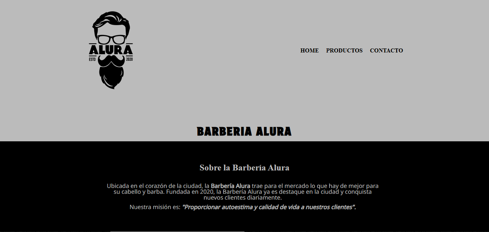
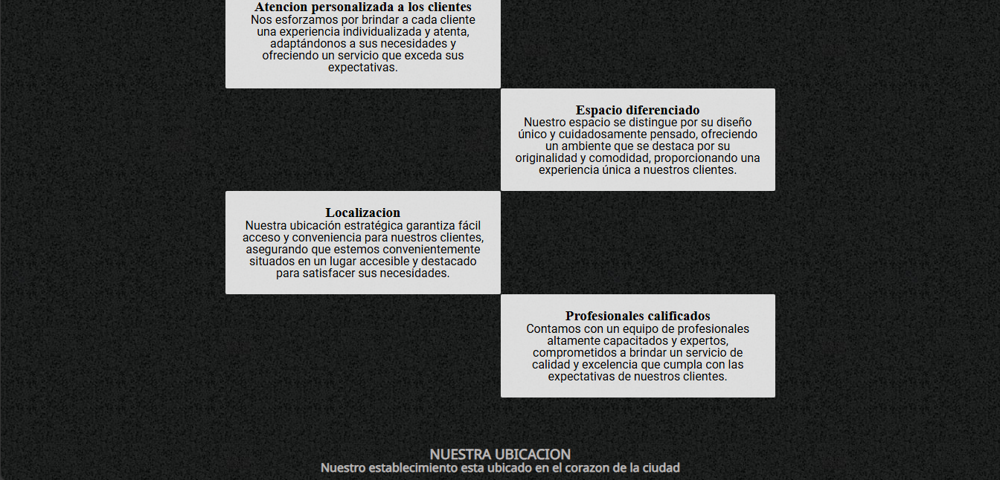
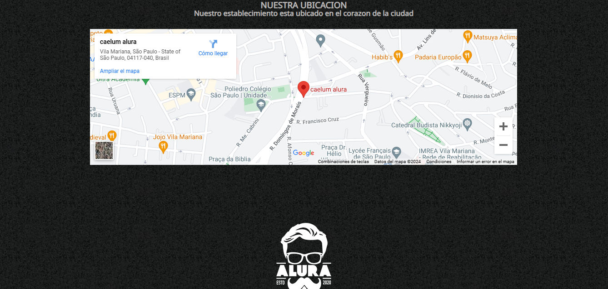
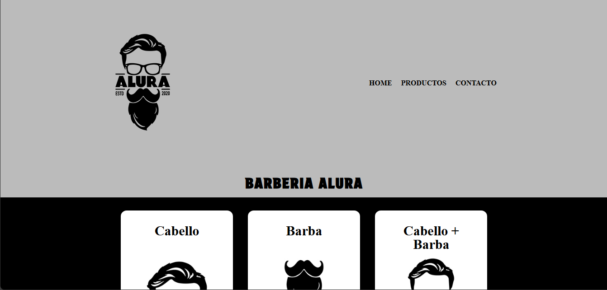
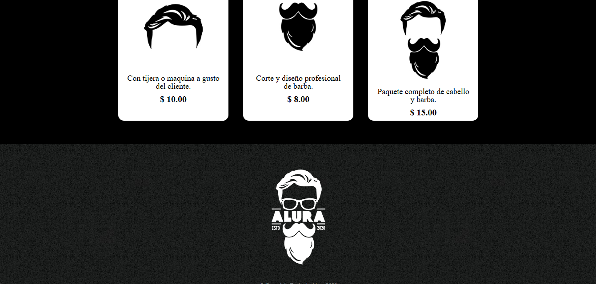
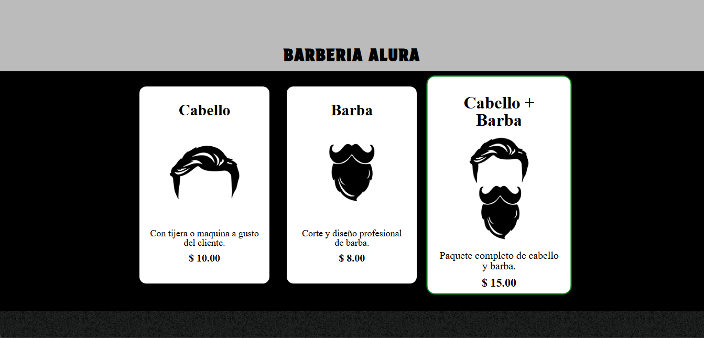
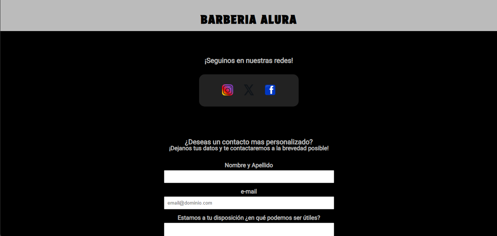
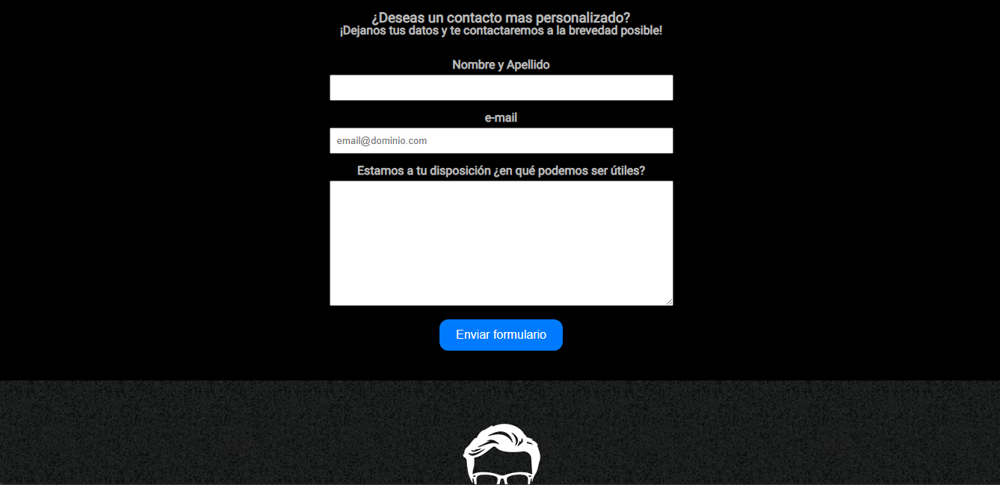

<h1 align="center"> Welcome to Alura Barbershop </h1>
<h3 align="center"> A landing page for a fictional barber shop </h3>

 

# Index

1. [Project Description](#project-description)
2. [Tools Used](#tools-used)
3. [Future Plans](#future-plans)

## Project Description

A landing page for a fictional barbershop created as an integration project for the "Introduction to Front-End Development" course from Alura Latam to put into practice all the 
theoretical knowledge acquired and to demonstrate a solid understanding of the basics of HTML5 and CSS3.

### Screenshots

#### Homepage

  
  
  

#### Productos (products/services)

  
  
  

#### Contacto (contact)

  
  

## Tools Used

This landing page was developed using the following technologies:

* HTML5
* CSS3
* Visual Studio Code
